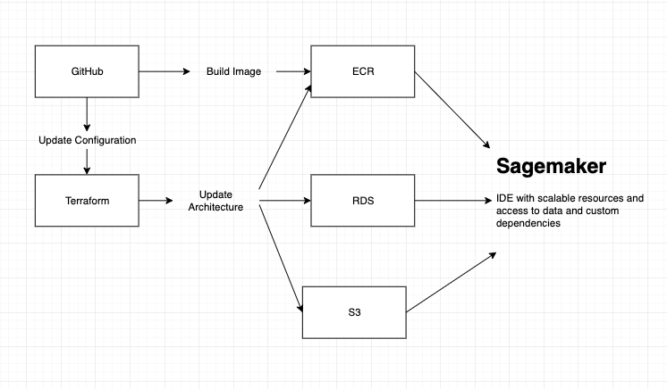

# generative-story-pipeline

A monorepo which facilitates autoanimation of childrens stories and uploads them to youtube.

| Repository |  Purpose |
| :--- | :------- |
| scraping | Collects data from the gutenburg project and uploads them to RDS database and S3 bucket |
| opensora | Uses the opensora model to generate content from saved (image, text) pairs |
| video_generation | Takes generated video segments, stitches them together, and uploads them to youtube |

##### The infrastructure is managed from the `infra` directory, making two architectures available.

1. local

This architecture mimics the AWS setup locally using docker compose and localstack, much of the code will run, however it would require the opensora model to run locally, which takes 80G of GPU memory.

2. AWS

An AWS architecture can be setup with terraform in `infra/remote`. This requires you to supply credentials as variables in your aws account.

